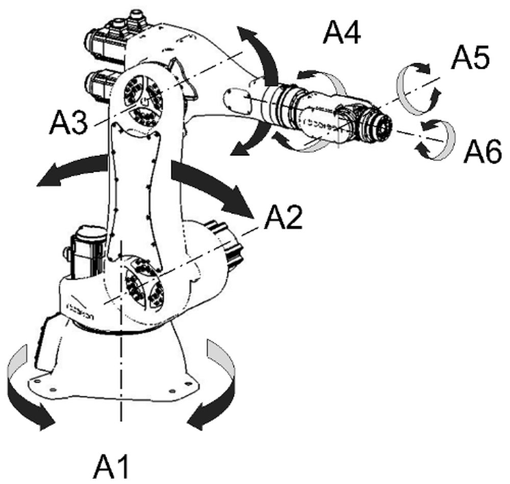

# Техническое задание на разработку малогабаритного имитатора шестизвенного робота-манипулятора

# 1. Наименование, 
1.1 Шифр ОКР

1.2 Основание выполнения ОКР

1.3 Исполнитель и сроки выполнения ОКР

# 2. Цель выполнения ОКР
2.1 Наименование и обозначение изделия

ИРМ - имитатор робота-манипулятора

КС ИРМ - комплект для сборки ИРМ.

ИРМ разрабатывается для использования в качестве учебного пособия при обучении работе с промышленными манипуляторами.

КС ИРМ может использоваться в качестве робототехнического конструктора при обучении робототехнике.

# 3. Технические требования к изделию

3.1 Состав изделия

В состав ИРМ входят: 

1) шасси, 

2) опорно-поворотное устройство, 

3) звенья манипулятора, 

4) поворотный держатель инструмента, 

5) пульт управления, 

6) инструкция по сборке, 

7) инструкция по управлению.

3.2 Требования назначения

3.2.1 ИРМ должен выполнять функции робота-манипулятора с ограничениями по точности и грузоподъемности:

Максимальная грузоподъемность - не менее 100 г.

Точность позиционирования +/- 10мм

Вылет - 0.75 м

Число степеней свободы - см. рис.

3.2.1 КС ИРМ должен позволять крупноузловую сборку-разборку по инструкции в течение 2-х ак. часов.

3.2.2 КС ИРМ не должен требовать специального инструмента для сборки/разборки в ходе изучения.

3.3 Требования эргономики, обитаемости и технической эстетики

3.3.1 Максимальное напряжение в схемах питания - 14в.

3.3.2 Пульт управления должен быть выполнен на основе типового планшетного ПК и бфть функционально аналогичен ПУ промышленных РМ

3.3.3 На корпусе ИРМ должна располагаться кнопка аварийного отключения.

3.3.4 Конструкция и сполнение ИРМ не должны иметь острых углов, заусениц и других элементов, способных зацепиться за одежду оператора или других лиц, находящихся в зоне функционирования ИРМ.

3.3.5 КС ИРМ не должен включать в себя узлы и элементы, могущие представлять опасность при контакте с кожей человека.

3.4 Требования к эксплуатации, хранению, удобству технического обслуживания и ремонта

3.4.1 Эксплуатация ИРМ возможна в 2-х вариантах:

1) Обучение работе с РМ,

2) Обучение сборке-разборке РМ.

3.4.2 ИРМ может храниться как в собранном, так и в разобранном состоянии. Для хранения в разобранном состоянии используется контейнер с отсеками для 
частей ИРМ, документации и ЗИП.

3.5 Транспортирование

3.5.1 ИРМ транспортируется в разобранном состоянии в транспортном контейнере (см. 3.4.2). 

3.5.2 Требования к транспортировке дляжны быть аналогичны бытовой электронике.

3.6 Требования безопасности

3.6.1 Класс защиты от поражения электрическим током - 00.

3.6.2 Степень защиты оболочки по классификации IP - IP-50.

3.6.3 Перед началом движения манипулятора подается светозвуковой сигнал.

3.6.4 Силовые и управляющие цепи ИРМ должны быть защищены плавкими предохранителями.

3.7 Требования стандартизации и унификации

3.7.1 Для сборки КС ИРМ применятеся крепеж стандартов DIN 912, DIN 7985, DIN 965, DIN 934.

3.7.2 В комплект поставки входят:

1) Отвертка стандарта PH0 диэлектрическая,

2) Набор отверток или ключе стандартов H3 - H6,

3) Набор ключей комбинированных 7мм, 8мм, 10мм, 12мм, 13 мм.

3.8 Требования технологичности

3.8.1 ИРМ должен использовать распространенные электронные блоки, входящие в большинство конструкторов для детского творчества (или совместимые с ними).

3.8.2 ИРМ не должен требовать ручной пайки при крупноузловой сборке.

3.8.3 При изготовлении узлов не должны применяться дефицитные или токсичные материалы.

3.8.4. увеличение примененяемости изделия и его составных частей при помощи стандартизации и унификации.

3.9 Конструктивные требования

3.9.1 ИРМ должен представлять собой макет робота-манипулятора (см. рис.).

3.9.2 Перемещение звеньев ИРМ должно осуществляться за счет применения типовых шаговых или коллекторных сервоприводов.

3.9.3 Звенья ИРМ должны быть выполнены максимально облегченными для снижения нагрузки на приводы.

3.9.4 Редукторы, используемые в ИРМ допускают люфт концевого звена не более 10 мм.

3.9.5 Управление ИРМ осуществляется с ПДУ, подключаемого к ИРМ по беспроводной связи.

# 5. Требования к документации

5.1 На ИРМ и КС ИРМ разрабатывается следующая документация:

5.1.1 Инструкция по крепноузловой сборке.

5.1.2 Инструкция программиста и системного программиста.

5.1.3 Паспорт изделия.

